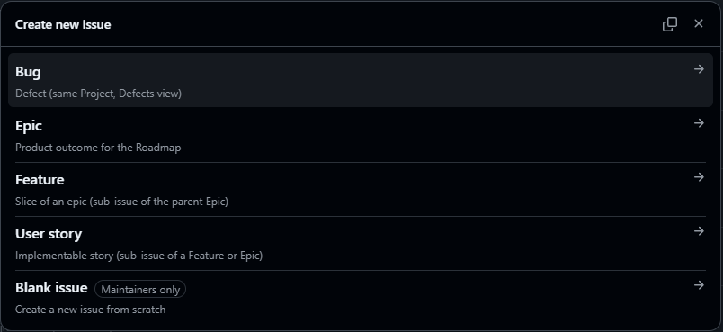

# Agentic Scrum User Guide

**Document type:** End-user configuration and operations guide  
**Audience:** Technical operators running Hermes Agent or Claude Code  
**Related files:** `GITHUB/ONCE.md`, `references/POLICIES/role-binding.md`, `references/POLICIES/tech-lead.md`

This bundle adds Scrum (backlog, sprint, stories, and defects) to agents you already operate. It does not replace persona, memory, or ventures in a co-founder clone. Those remain in the clone. These skills are add-ons.

| Item | Value |
|------|--------|
| Runtimes | Hermes Agent, Claude Code |
| Working copy | `$HOME/workspace/agentic-scrum-development` |
| Repository | https://github.com/jracostab/agentic-scrum-development |
| Default branch | `main` |
| Development branch | `dev` |

---

## Contents

1. [Prerequisites](#1-prerequisites)
2. [Install skills](#2-install-skills)
3. [Team roles and Scrum hats](#3-team-roles-and-scrum-hats)
4. [Walkthroughs](#4-walkthroughs)
5. [Daily workflow](#5-daily-workflow)
6. [GitHub Issues and Projects](#6-github-issues-and-projects)
7. [Skill catalog and usage](#7-skill-catalog-and-usage)
8. [Directory layout](#8-directory-layout)
9. [Uninstall](#9-uninstall)

---

## 1. Prerequisites

Python 3.11 or later, and Hermes Agent, Claude Code, or both. Install the GitHub CLI (`gh`) only when you configure GitHub or file issues. Binding a Scrum hat does not require `gh`.

```bash
export AGENTIC_SCRUM_HOME="$HOME/workspace/agentic-scrum-development"
chmod +x "$AGENTIC_SCRUM_HOME/scripts/"*.sh "$AGENTIC_SCRUM_HOME/scripts/"*.py
```

---

## 2. Install skills

Run once. Hermes receives symlinks (updates follow this pack). Claude Code receives **copies** so the Skills tab can list them.

```bash
python3 "$AGENTIC_SCRUM_HOME/scripts/install_skills.py" --hermes --claude
```

To attach the same skills to one Hermes profile (required for that profile’s Skills hub) and one co-founder clone (Claude project skills):

```bash
python3 "$AGENTIC_SCRUM_HOME/scripts/install_skills.py" \
  --hermes --claude \
  --profile tinto \
  --project "$HOME/workspace/tinto-co-founder"
```

Restart Hermes and start a **new** Claude Code chat. Confirm:

```bash
hermes skills list | grep agentic-scrum
ls ~/.claude/skills/agentic-scrum-po/SKILL.md
```

You do not need `agent/config/role.txt` in the clone.

### Make skills visible in the product UI

**Hermes.** User skills live in `~/.hermes/skills/`. This install already put `agentic-scrum*` there (`hermes skills list` shows `local` / `enabled`). Open the Skills hub or run `/skills`. For a **named profile** (gateway or `hermes -p tinto`), also pass `--profile tinto` so copies exist under `~/.hermes/profiles/tinto/skills/`. Then `/reload-skills` or restart that session.

**Claude Code.** User skills live in `~/.claude/skills/<name>/SKILL.md`. The installer copies (does not symlink) so the Skills panel can index them. Open a new conversation, open **Skills**, and look for `agentic-scrum-*`. You can also invoke by name in chat (`Load agentic-scrum-po`). Project-local skills appear when you pass `--project` (writes `<clone>/.claude/skills/`). If the tab is empty, confirm the path above and start a new chat; do not reuse a session started before install.

---

## 3. Team roles and Scrum hats

**Team role** is who the agent is (Co-Founder, CEO, CTO, Distinguished Engineer, Principal Engineer). It belongs in the clone persona (`SOUL.md`). Skills never overwrite it.

**Scrum hat** is which process the agent may run. Hats are stored as a list on a sidecar file (not in git). An agent may hold more than one hat.

| Hat | Typical team roles | Skill |
|-----|--------------------|--------|
| product-owner | Co-Founder; DE, PE, or CTO when they own a slice | `agentic-scrum-po` |
| developer | DE, PE; CTO only if you add the hat | `agentic-scrum-developer` |
| tech-lead | CTO, DE, PE (split features and draft sprints) | `agentic-scrum-tech-lead` |

The CEO team role has no Scrum hat. See `references/POLICIES/tech-lead.md` for tech-lead duties.

### Default hats

Applied when you bind a team role and do not list hats:

| Team role | Default hats |
|-----------|----------------|
| co-founder | product-owner |
| cto | tech-lead |
| distinguished-engineer, principal-engineer | tech-lead, developer |
| ceo | none |

Add a hat without removing others: `bind hat product-owner`.

### Where bindings are stored

| Runtime | Path |
|---------|------|
| Hermes | `~/.hermes/profiles/<profile>/scrum-bindings.yaml` |
| Claude Code | `~/.claude/agentic-scrum-bindings.yaml` |

Optional clone file (team role only): `$COFOUNDER_ROOT/agent/config/role.txt`.

### Operator replies

| Reply | Effect |
|-------|--------|
| `bind co-founder` (or `cto`, `ceo`, `distinguished-engineer`, `principal-engineer`) | Save team role and default hats |
| `bind hat product-owner` (or `developer`, `tech-lead`) | Add that hat; keep existing hats |
| `session tech-lead` | This session only; do not write the sidecar |
| `stop` | Do not run the skill |

---

## 4. Walkthroughs

### 4.1 First bind on a Co-Founder

1. Run `./start.sh --profile tinto`.
2. Load `agentic-scrum-po` and refresh the backlog.
3. The skill asks you to bind (no sidecar yet).
4. Reply `bind co-founder`. Hats: `product-owner` only.
5. Persona and ventures remain in `agent/SOUL.md`. Later sessions on this profile do not prompt.

### 4.2 Co-Founder must not implement

1. The profile is co-founder with hat product-owner.
2. Load `agentic-scrum-developer`.
3. Hat `developer` is missing. The skill offers `bind hat developer`, `session developer`, or `stop`.
4. Reply `stop`. The team role stays Co-Founder. The clone is unchanged.

### 4.3 Principal Engineer also acts as Product Owner

1. On first load, reply `bind principal-engineer` (hats: tech-lead, developer).
2. Later, load `agentic-scrum-po`.
3. Reply `bind hat product-owner`.
4. Hats are developer, tech-lead, and product-owner. The team role remains Principal Engineer.

### 4.4 New Hermes profile, same clone

Bindings are per Hermes profile, not per git clone. A new profile has no sidecar until you bind.

### 4.5 Tech-lead splits an epic

1. The agent is `principal-engineer` (already has tech-lead).
2. Load `agentic-scrum-tech-lead`.
3. Split features, draft a sprint, wait for `sprint yes`. Do not merge. Implement only if the agent also has the developer hat (DE and PE do by default; CTO does not unless you `bind hat developer`).

---

## 5. Daily workflow

The Founder passes gates in chat or on the GitHub issue: `approved`, `proceed`, `handle`, `sprint yes`, `send back`. The Founder merges pull requests. Agents never merge.

1. Co-Founder with `agentic-scrum-po` drafts epics. Founder: `approved`.
2. Tech-lead with `agentic-scrum-tech-lead` splits stories. Founder: `sprint yes`.
3. Founder comments `/implement` on a story.
4. Developer with `agentic-scrum-developer` posts a plan; Founder: `approved`; then branch, tests, and PR `Closes #N`.

Persona comes from the clone. Process comes from the skill.

---

## 6. GitHub Issues and Projects

A GitHub Organization is not required. Setup detects whether the repository belongs to an organization or a personal account and selects a mode. You run the same commands in both cases.

Use one GitHub Project per venture, with three views:

| View | Contents |
|------|----------|
| Roadmap | Epics |
| Sprint | Current iteration; all items except epics |
| Defects | Bugs |

### 6.1 Classification: types versus labels

| | Organization (`org/repo`) | Personal account (`user/repo`) |
|--|---------------------------|--------------------------------|
| Classification | Issue types Epic, Feature, Story, Bug | Labels `Epic`, `Feature`, `Story`, `Bug` |
| Roadmap | `type:Epic` | `label:Epic` |
| Sprint | `-type:Epic` | `-label:Epic` |
| Defects | `type:Bug` | `label:Bug` |
| Create issue | `gh --type` | `gh --label` (no type) |
| Operator action | Run setup once (`admin:org` only if types are missing) | Run setup once. Labels are the intended path, not an error |

`scripts/workitems.py create Epic|Story|Bug` selects types or labels. Set `REPO` and `GH_PROJECT`. Set `GH_SCRUM_MODE=types` or `labels` only to override detection.

### 6.2 One-time setup

The GitHub CLI needs scopes `repo` and `project`. Add `admin:org` only to create organization issue types.

Organization:

```bash
export REPO=teocalli-ai/skunkworks-test-hardness
export GH_PROJECT="Venture board"
python3 "$AGENTIC_SCRUM_HOME/scripts/setup_github.py" \
  --repo "$REPO" --title "$GH_PROJECT" \
  --clone /path/to/skunkworks-test-hardness
```

Personal account (same script):

```bash
export REPO=jracostab/skunkworks-test-hardness
export GH_PROJECT="Venture board"
python3 "$AGENTIC_SCRUM_HOME/scripts/setup_github.py" \
  --repo "$REPO" --title "$GH_PROJECT" \
  --clone /path/to/skunkworks-test-hardness
```

Re-running reuses the Project with that title. Issue templates are pushed to the repo default branch automatically (`config.yml` turns on the template chooser).

### 6.3 Create issues from a template (UI)

GitHub shows the template list only on the **repository Issues** page. Project **Add item** does not open a template; it creates a blank draft.

After templates are pushed, GitHub often serves a cached blank page. **Hard-refresh** the chooser before you conclude it failed:

- Windows / Linux: `Ctrl+Shift+R`
- macOS: `Cmd+Shift+R`

Then:

1. Open `https://github.com/<owner>/<repo>/issues/new/choose`
2. You should see four cards: Epic, Feature, User story, Bug (illustration below).
3. Click one card. That page is the form.
4. Fill Description, Definition of Done, then Acceptance Criteria.



If the list is still missing after a hard refresh, confirm you are on `/issues/new/choose` (not `/issues/new`) and that you are logged in with permission to file issues.

### 6.4 Create issues from the CLI

The same commands apply to organization and personal repositories:

```bash
export REPO   # same value as setup
export GH_PROJECT="Venture board"
python3 "$AGENTIC_SCRUM_HOME/scripts/workitems.py" create Epic "Title" ./body.md
python3 "$AGENTIC_SCRUM_HOME/scripts/workitems.py" create Story "Title" ./body.md --parent 12
python3 "$AGENTIC_SCRUM_HOME/scripts/workitems.py" create Bug "Title" ./body.md
```

Scrum hats remain in the sidecar. GitHub Assignee is who does the work. Additional notes: `GITHUB/ONCE.md`.

---

## 7. Skill catalog and usage

Each skill runs a **role check** first (`scrum_bindings.py check`). If the hat does not match, the agent asks `bind` / `session` / `stop` and does not start work.

Load the skill in chat (`Load agentic-scrum-po`) or from the Skills tab, then give the example prompt.

### `agentic-scrum`

Index of gates and which skill to load next.

You say: `Load agentic-scrum. What skill should file epics?`  
What happens: The agent points at `agentic-scrum-po`, lists G1–G4, and does not create GitHub issues.

### `agentic-scrum-po`

Product backlog. Requires hat `product-owner`. Reads clone `SOUL.md`. Does not write application code.

You say: `Refresh the backlog for this venture.`  
What happens: Role check; if MATCH, drafts 3–7 epics in chat and **stops**. After you type `approved`, it creates Epic issues on the venture Project (types or labels per §6).

### `agentic-scrum-tech-lead`

Split epics and draft sprints. Requires hat `tech-lead` (CTO, DE, PE).

You say: `Decompose epic #12 into stories for the next sprint.`  
What happens: Proposes features/stories with testable DoD, waits for `approved`, creates sub-issues, then waits for `sprint yes` before treating work as committed.

### `agentic-scrum-ceo`

Strategy only. Requires team role `ceo`.

You say: `Does this epic belong on the product?`  
What happens: A short alignment or challenge. That is not G1 approval and does not create issues.

### `agentic-scrum-developer`

Implement one story or bug. Requires hat `developer`.

You say: `Take GitHub issue #41.`  
What happens: Reads the issue. Story → plan comment, then **stop**. Bug → reproduce and RCA comment, then **stop**. After you `approved` / `proceed` / `handle`, it branches, implements, tests, and opens a PR `Closes #41`. It never merges.

### `agentic-scrum-story-implement`

Procedure used with the developer skill (plan/RCA → PR). Same hat rule: any bound hat; usually loaded with `agentic-scrum-developer`.

You say: `Follow story-implement on #41.`  
What happens: Same stop-at-G3 behavior as the developer skill.

### `agentic-scrum-sprint`

Sprint = Project Iteration, not a label.

You say: `Plan sprint 2026-w39 from these stories.`  
What happens: Proposes 1–3 ready stories, waits for `sprint yes`, then tells you to put those issues on the current Iteration.

### `agentic-scrum-work-items`

Create and comment on issues. Requires any bound hat.

You say: `Create an Epic titled "Clone-and-run on Linux" after I approved.`  
What happens: `workitems.py create Epic …` with `--type` (org) or `--label Epic` (personal). Parent stories use `--parent`. No `type:` GitHub labels.

---

## 8. Directory layout

```
$HOME/workspace/agentic-scrum-development/
  README.md
  SKILL.md
  skills/          One directory per skill
  references/      Flows and policies
  scripts/         Install, bindings, GitHub
  GITHUB/          Issue forms and setup notes
  TRIGGERS/        Optional comment workflow
```

Sidecar files (not stored in the clone):

| Runtime | Path |
|---------|------|
| Hermes | `~/.hermes/profiles/<profile>/scrum-bindings.yaml` |
| Claude Code | `~/.claude/agentic-scrum-bindings.yaml` |

---

## 9. Uninstall

Removes skill links only. The pack and the GitHub Project remain.

```bash
rm -f ~/.hermes/skills/agentic-scrum ~/.hermes/skills/agentic-scrum-*
rm -f ~/.claude/skills/agentic-scrum ~/.claude/skills/agentic-scrum-*
```

To remove a Hermes binding, delete that profile’s `scrum-bindings.yaml`.
